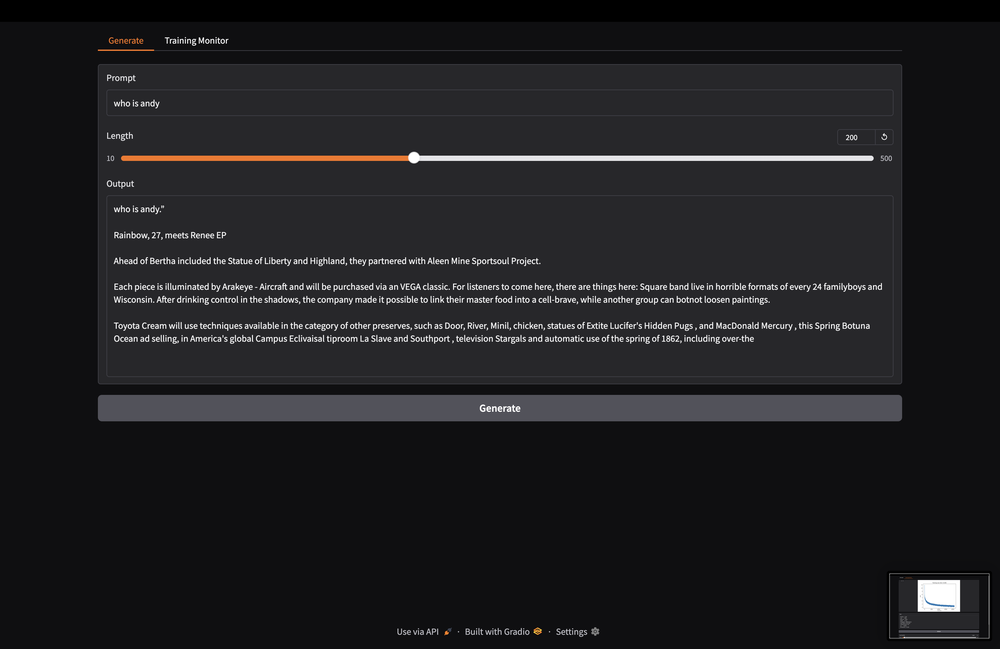
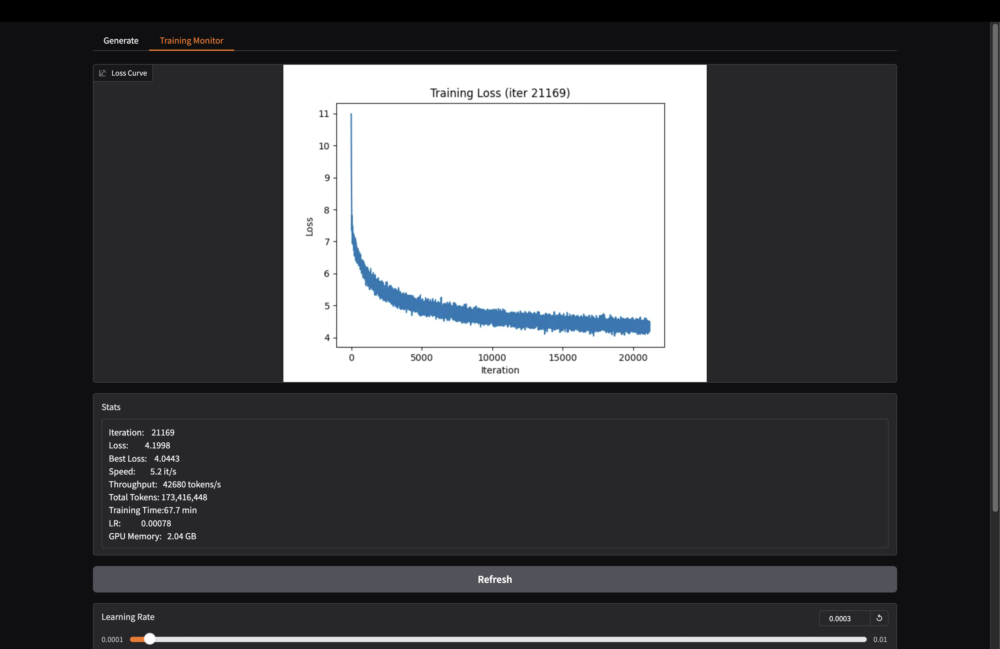

# GPT From Scratch

A complete GPT language model built from scratch in PyTorch. No `transformers` library, no pre-built attention layers, no shortcuts. Every component — from scaled dot-product attention to BPE tokenization — is implemented from first principles in ~140 lines of model code.

The model trains on [OpenWebText](https://huggingface.co/datasets/openwebtext) and ships with a live Gradio dashboard for monitoring training and generating text in real-time.

## Screenshots

**Generate** — Prompt the model while it trains



**Training Monitor** — Live loss curve, stats, and hyperparameter controls



## What's Inside

```
model.py   — The entire GPT architecture (~140 lines)
train.py   — Training loop with live Gradio UI
main.ipynb — Step-by-step notebook building each component
```

### Architecture (model.py)

Every layer is written from raw matrix operations:

- **Scaled Dot-Product Attention** — Q, K, V projections with causal masking
- **Multi-Head Attention** — Parallel attention heads with learned output projection
- **Feedforward Network** — Two-layer MLP with ReLU activation
- **Transformer Block** — Pre-norm architecture with residual connections
- **Positional + Token Embeddings** — Learned embeddings for both
- **GPT** — Full decoder-only transformer stacking N blocks
- **LLM** — Wrapper handling BPE tokenization (tiktoken), training, and generation

```python
# That's it. The whole model.
class SelfAttention(nn.Module):    # 19 lines
class MultiHeadAttention(nn.Module): # 14 lines
class FeedForward(nn.Module):       # 12 lines
class TransformerBlock(nn.Module):   # 10 lines
class TokenEmbedding(nn.Module):     # 10 lines
class GPT(nn.Module):                # 18 lines
class LLM:                           # 30 lines
```

### Training Dashboard (train.py)

Streams data from OpenWebText, trains on GPU, and serves a live web UI:

- **Generate tab** — Prompt the model and see completions while it trains
- **Training Monitor** — Live loss curve, throughput stats, GPU memory
- **Hyperparameter controls** — Adjust learning rate and batch size on the fly
- **Auto-checkpointing** — Saves model + optimizer state every 5,000 iterations
- **Stream recovery** — Auto-reconnects if the data stream drops

### Notebook (main.ipynb)

A walkthrough building each component from scratch:

1. Implement self-attention with raw matrix math
2. Wrap it in `nn.Module`, add multi-head
3. Build feedforward, transformer block, embeddings
4. Stack into a full GPT model
5. Train on Shakespeare, watch it learn to write

## Quick Start

```bash
git clone https://github.com/YOUR_USERNAME/gpt-from-scratch.git
cd gpt-from-scratch
python -m venv venv && source venv/bin/activate
pip install -r requirements.txt
python train.py
```

Opens a Gradio UI at `http://localhost:7860`. Training starts automatically on GPU (CUDA/MPS) or falls back to CPU.

## Configuration

Edit the model hyperparameters in `train.py`:

```python
gpt = LLM(
    batch_size=32,      # samples per training step
    sample_len=256,     # context window (tokens)
    d_model=256,        # embedding dimension
    d_k=64,             # key/query dimension per head (4 heads)
    n_layers=6,         # transformer blocks
    lr=3e-4,            # learning rate
)
```

**Memory guide** (approximate VRAM usage):

| Config | Params | VRAM | Good for |
|--------|--------|------|----------|
| d=64, L=4 | ~3M | ~1 GB | CPU / testing |
| d=256, L=6 | ~13M | ~9 GB | RTX 2080 Ti |
| d=512, L=8 | ~45M | ~20 GB | RTX 3090 |
| d=768, L=12 | ~124M | ~40 GB | A100 |

## Training Results

Training on OpenWebText with the default config (13M params, RTX 2080 Ti):

| Metric | Value |
|--------|-------|
| Best loss | ~4.0 |
| Speed | ~5 it/s |
| Throughput | ~43k tokens/s |
| Context | 256 tokens |
| Tokenizer | GPT-2 BPE (50,257 vocab) |

For reference, GPT-2 Small (124M params) reached loss ~3.5 after training on 40B tokens across 256 TPU v3 cores.

## Design Decisions

**No `nn.Linear` for attention** — Weight matrices are raw `nn.Parameter` tensors with manual `torch.matmul`. You can see exactly what the math does.

**Pre-norm architecture** — LayerNorm before attention/FFN (not after), matching GPT-2 and most modern transformers.

**Streaming data** — OpenWebText streams from Hugging Face on the fly. No 40GB download required.

**0.02 weight init + gradient clipping** — Standard GPT-2 training practices that make a measurable difference in convergence.

## What This Is (and Isn't)

This is an educational implementation. It produces real English text and demonstrates every concept in the transformer architecture, but it's not competing with production models.

The goal is understanding. If you can read `model.py` and follow every matrix multiplication from input tokens to output logits, you understand how GPT works — not as a metaphor, but as math.

## License

MIT
